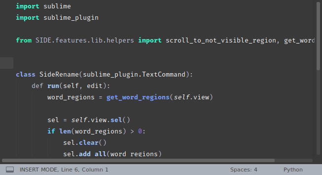

## SIDE 

SIDE makes Sublime just a bit more useful.
The goal of SIDE is to mimic LSP features without LSP. It uses only the things that are already in Sublime.

How is that even possible?
Well SIDE is smart as much as you are.
You can be the best or the worst language server. That depends on you. 
SIDE will just try to help as much as it can.

### Features
* Definition
* Signature Help
* Highlight
* Rename
* References
* Completions
* Diagnostics
* Code Actions


**Definition** will show you definition/s filtered by the file extension, which in most cases is better than the default behavior of the `goto_definition` command. 


Show **Signature Help** when hovering over `function`/`class` symbols. 
Or when typing a `(` after a function call.
Or a `,` when typing the function arguments. 

You can also assign a key binding to trigger it manually.

When the signature is visible, you can use the `Up`|`Down` arrows to go through them. 
When you found the definition you want press `enter` and it will take you to that definition. Note that this won't work if the cursor is next to a open bracket `(`. In that case it will just insert a new line.


**Highlight** will underline the word under cursor, smartly. 

SIDE will highlight words in the given function scope or the entire file, depending on the *Find All MODE*.
The mode can be toggled through the command palette `SIDE: Toggle Find All` or by assigning a keyboard shortcut. 
Current mode will be shown in the status bar with the following icons:

- `⧂ {highlighted count}` - *Find All In File* highlights all words in the entire file.
- `⦾ {highlighted count}` - *Find All In Scope* highlights only words in current function scope, unless that word is a function.

There are two commands for going to the `next`/`previous` highlight. You need to assigning a keyboard shortcut to use them.


**Rename** will select all the highlighted words for you to edit. 

If you press the rename key-binding again, you can go back and forth to the first or last highlighted word. 




**References** panel shows all references for the given symbol.


Sometimes it is useful to cycle through the references in just the open views, in which case you can assign a key binding.   


**Completions** will show all the symbols and words found in the opened views, with the type of the symbol and the file from where it is found. The types can be:
* `[c]` - class
* `[m]` - method
* `[f]` - function
* `[s]` - struct
* `[t]` - trait
* `[#]` - unknown, but it exist somewhere in the open views, probably a variable, or a word in a comment
* `[FILE]` - file
* `[FOLDER]` - folder

Get PATH autocompletions when inside a stings that starts with `./`.

SIDE has a feature called **One Level Indexing**. Here is how it works. 
If SIDE is 100% sure that some file `B` is related to the current file `A` you are editing.
It will show you all the symbols defined it that file `B` in completions. 


With **Diagnostics**  never misspell a function name again. Just set Sublime's `spell_check` setting to `true`. 


**Code Actions** can correct spelling mistakes and search the Internet.


When you need an advice or a Yes/No answer, ask SIDE and it will give one. 
SIDE <3 Chuck Norris. Chuck will help you to get through the day with a smile. :)


### Configure SIDE

Assign key bindings you would want to use by opening `Preferences/Package Settings/SIDE/Key Bindings` menu.

SIDE tries to be configured out of the box. But because SIDE is young, it is likely that you language `x` is not yet properly set up for SIDE.
So you need to configure SIDE to know what are references or definitions, because the default `SOME_LANGAUGE.tmPreferences` didn't account for them.
Or there are symbols you would like to remove from the index. 

Here is how to configure your language `X` for SIDE and Sublime. 

#### Adding references

Create a `{YourLanguage}References.tmPreferences`. 
Save it to your `Packages\User` or `SIDE/languages` (if you plan to do a Pull Request, PR are welcome) folder, with the following content:

```xml
<?xml version="1.0" encoding="UTF-8"?>
<plist version="1.0">
<dict>
	<key>scope</key>
	<string>{a list of scopes}</string> // <-- add your scopes here
	<key>settings</key>
	<dict>
		<key>showInIndexedReferenceList</key>
		<string>1</string>
	</dict>
</dict>
</plist>
```
> All the strings bellow `scope` key will be added to the references list. 

Here is how SIDE's configuration for rust references looks like. The file is named `RustReferences.tmPreferences` and is placed in `SIDE/languages` folder.

```xml
<?xml version="1.0" encoding="UTF-8"?>
<plist version="1.0">
<dict>
	<key>scope</key>
	<string>support.function.rust</string>
	<key>settings</key>
	<dict>
		<key>showInIndexedReferenceList</key>
		<string>1</string>
	</dict>
</dict>
</plist>
```

#### Adding definitions 

Create a `{YourLanguage}IndexedSymbols.tmPreferences`. Save it to your `Packages\User` or `SIDE/languages`(if you plan to do a Pull Request) folder.

Here is how SIDE's configuration for rust definitions looks like.

```xml
<?xml version="1.0" encoding="UTF-8"?>
<plist version="1.0">
<dict>
	<key>name</key>
	<string>Rust Symbols</string>
	<key>scope</key>
	<string>entity.name.function.rust, entity.name.macro.rust, entity.name.struct.rust, entity.name.enum.rust, entity.name.module.rust, entity.name.type.rust, entity.name.impl.rust, entity.name.trait.rust</string>
	<key>settings</key>
	<dict>
		<key>showInIndexedSymbolList</key>
		<integer>1</integer>
	</dict>
</dict>
</plist>
```

### What is the point of SIDE?

The point of SIDE is to make you think. It is great to have great auto completion, diagnostics, ..., but where is the fun in that.

When you use SIDE, it won't warn you if you make mistakes (except if it is a spelling mistake and you enabled spell checking). We all make mistakes and we should learn from them.